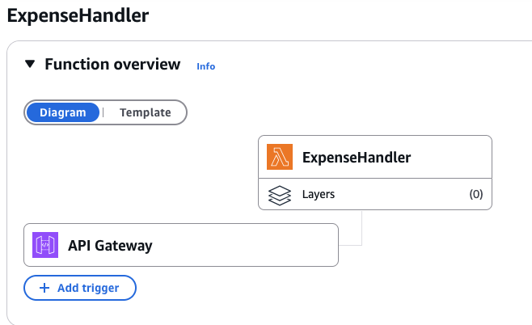
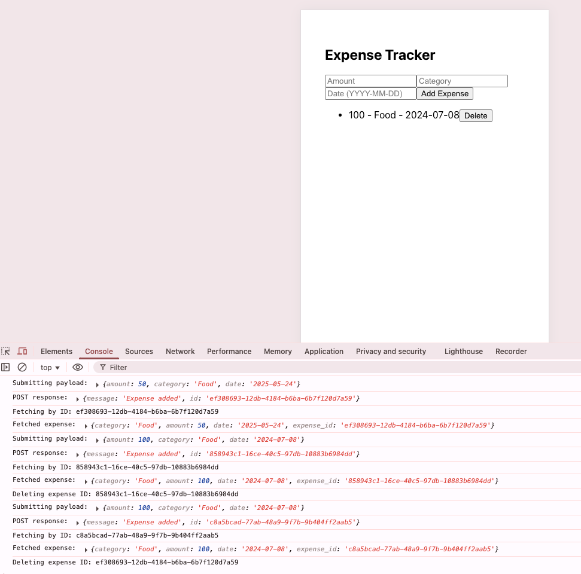
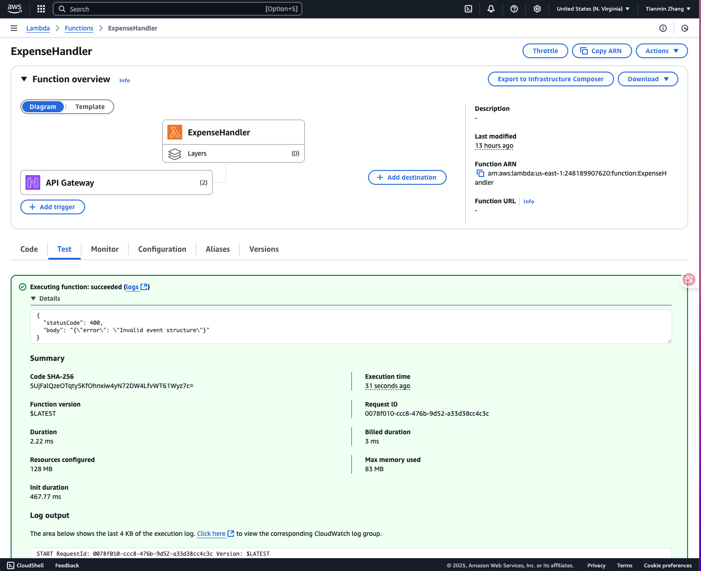

# Serverless Expense Tracker 💸

This is a full-stack expense management application built with **React** on the frontend and **AWS Serverless Architecture** on the backend.

---

## 🔗 Live Demo

Frontend runs locally at: `http://localhost:3000`  
Backend powered by AWS Lambda, DynamoDB, and API Gateway.

---

## 🛠 Tech Stack

- **Frontend**: React, fetch API, basic CSS
- **Backend**: AWS Lambda (Python), API Gateway (HTTP API), DynamoDB
- **Architecture**: 100% Serverless 

---

## ✨ Features

- ✅ Add new expenses 
- ✅ View existing expenses
- ✅ Delete expenses 

- ✅ Fully stateless frontend 
- ✅ API integrated with AWS Lambda via API Gateway 

---

## 🧠 Why Serverless?

- **No infrastructure to manage**
- **Auto-scaling by default**
- **Pay-per-use** = lower cost
- **Easier to deploy and maintain**

---

## 🔌 Backend API (AWS Lambda + API Gateway)

| Method | Endpoint                  | Description        |
| ------ | ------------------------- | ------------------ |
| POST   | `/expense`                | Add a new expense  |
| GET    | `/expense?expense_id=xxx` | Get single expense |
| PUT    | `/expense`                | Update expense     |
| DELETE | `/expense?expense_id=xxx` | Delete expense     |

---

## 🧪 Local Dev Setup

```bash
git clone https://github.com/yourusername/serverless-expense-tracker.git
cd serverless-expense-tracker
npm install
npm start
```
